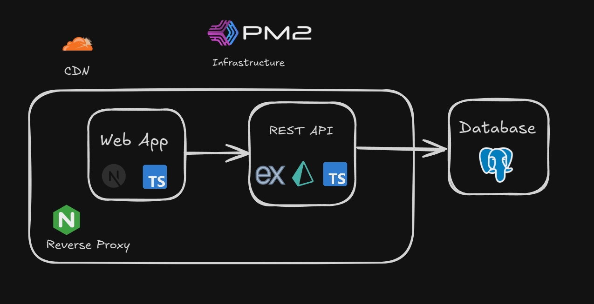

# 🚀 NOTO - Back-end API

> **Sistema de anotações pessoais moderno e seguro** - Inspirado no Notion, desenvolvido com foco em privacidade, performance e arquitetura escalável.



[](https://typescriptlang.org/)
[](https://expressjs.com/)
[](https://prisma.io/)
[](https://postgresql.org/)

**Status: ✅ Versão 1.0 Completa e Pronta para Produção**

- 🌐 [Front-end do projeto](https://github.com/bielsolosos/Noto-Front-end)
- 📱 [Demo ao vivo](https://noto.bielsolososdev.space/)

## 🏗️ Arquitetura de Produção

### **Stack Tecnológica**

- **Runtime**: Node.js com TypeScript
- **Framework**: Express.js com middlewares otimizados
- **ORM**: Prisma com PostgreSQL
- **Autenticação**: JWT com refresh tokens
- **Validação**: Zod schemas
- **Logs**: Sistema estruturado para auditoria
- **Documentação**: Swagger/OpenAPI automática
- **Deploy**: Docker + PM2 para alta disponibilidade

### **Arquitetura Modular (Domain-Driven Design)**

```
src/
├── 🏢 domain/          # Camada de Domínio
│   ├── models/         # Entidades de negócio
│   ├── repositories/   # Contratos de persistência
│   ├── services/       # Regras de negócio
│   └── validators/     # Validações Zod
├── 🔧 core/           # Camada de Infraestrutura
│   ├── config.ts      # Configurações ambiente
│   ├── prisma.ts      # Cliente do banco
│   ├── jwtUtils.ts    # Utilitários JWT
│   ├── bcrypt.ts      # Criptografia
│   └── logger.ts      # Sistema de logs
└── 🌐 api/           # Camada de Apresentação
    ├── controllers/   # Controladores HTTP
    └── routes/        # Definição de rotas
```

### **Fluxo de Dados**

1. **Cliente** → **Express Routes** → **Controllers**
2. **Controllers** → **Domain Services** → **Repositories**
3. **Repositories** → **Prisma ORM** → **PostgreSQL**
4. **Logs estruturados** para auditoria e monitoramento

## 🎯 Funcionalidades V1.0

### **🔐 Sistema de Autenticação Completo**

- ✅ Registro e login de usuários
- ✅ JWT com Access + Refresh Tokens
- ✅ Middleware de proteção de rotas
- ✅ Hash seguro de senhas (bcrypt)
- ✅ Gestão de sessões e expiração

### **📝 CRUD de Páginas Privadas**

- ✅ Criação, leitura, atualização e exclusão de páginas
- ✅ Conteúdo Markdown suportado
- ✅ Associação automática ao usuário autenticado
- ✅ Isolamento total entre usuários
- ✅ Timestamps automáticos (criação/atualização)

### **👥 Gerenciamento de Usuários**

- ✅ Cadastro com validação de email único
- ✅ Alteração de senha com verificação
- ✅ Sistema de roles (user/admin)
- ✅ Promoção/remoção de privilégios admin
- ✅ Exclusão de conta com confirmação

### **🛡️ Segurança & Validação**

- ✅ Validação robusta com Zod schemas
- ✅ Sanitização de dados de entrada
- ✅ Headers de segurança configurados
- ✅ Rate limiting para APIs sensíveis
- ✅ Logs de auditoria para ações críticas

### **📊 Observabilidade**

- ✅ Sistema de logs estruturados
- ✅ Documentação automática (Swagger)
- ✅ Monitoramento de performance
- ✅ Health checks para deploy
- ✅ Error handling centralizado

## � Deployment & Produção

### **Configuração de Ambiente**

```bash
# Variáveis essenciais
DATABASE_URL=postgresql://...
JWT_SECRET=your-secret-key
JWT_REFRESH_SECRET=your-refresh-secret
NODE_ENV=production
PORT=3000
```

### **Docker & Orquestração**

- 🐳 **Dockerfile otimizado** para produção
- 🔄 **Docker Compose** com PostgreSQL
- ⚡ **PM2** para cluster e auto-restart
- 📈 **Logs centralizados**

## 📈 Estado do Projeto

**✅ VERSÃO 1.0 - PRONTA PARA PRODUÇÃO**

- ✅ Todas as funcionalidades core implementadas
- ✅ Testes de segurança aprovados
- ✅ Performance otimizada
- ✅ Documentação completa
- ✅ Deploy configurado

### **🔮 Roadmap V2.0**

- 🌍 **Páginas Públicas** (sistema de blog)
- 🏷️ **Sistema de Tags** e categorização
- 📊 **Dashboard Analytics** para usuários
- 🔍 **Busca Full-Text** nas anotações
- 📤 **Export/Import** (JSON, Markdown)

## 🛠️ Tecnologias & Arquitetura

### **Design Patterns Implementados**

- 🏗️ **Repository Pattern** para abstração de dados
- 🎯 **Dependency Injection** para testabilidade
- 🧩 **Service Layer** para lógica de negócio
- 🔒 **Middleware Pattern** para autenticação
- 📋 **DTO Pattern** para validação de entrada

### **Decisões Arquiteturais**

- **TypeScript**: Type safety e melhor DX
- **Prisma**: ORM moderno com type generation
- **Express**: Framework maduro e performático
- **PostgreSQL**: Banco relacional robusto
- **JWT**: Autenticação stateless e escalável

## 🚦 Como Executar

### **Desenvolvimento Local**

```bash
# 1. Clone o repositório
git clone https://github.com/bielsolosos/Noto-Back-end.git

# 2. Instale dependências
npm install

# 3. Configure ambiente
cp .env.example .env

# 4. Execute migrações
npx prisma migrate dev

# 5. Inicie desenvolvimento
npm run dev
```

### **Produção com Docker**

```bash
# Build e deploy
docker-compose up -d --build

# Verificar saúde
curl http://localhost:3000/health
```

## 📚 Documentação Técnica

- 📖 **API Docs**: `/docs` (Swagger UI)
- 🗄️ **Prisma Studio**: `npx prisma studio`

---

**🎯 NOTO V1.0 - Sistema de Anotações de Produção**

Criado com ❤️ por **[bielsolosos](https://discord.com/users/bielsolosos)**

📧 **Contato**: Discord para dúvidas e colaborações
